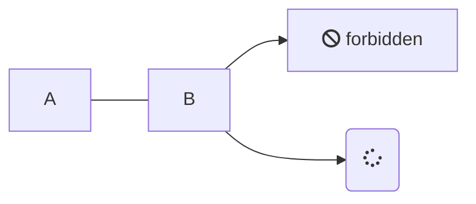

```html
<html>
    <head>
        ......
        <!-- Way1: CSP -->
        <meta http-equiv="Content-Security-Policy" content="upgrade-insecure-requests">

        <!-- Way2: BASE -->
        <base href="https">
        ......
    </head>
    <body>
        ......
        <script src="//cdn.jsdelivr.net/npm/katex@latest/dist/katex.min.js"></script>
        <link rel="stylesheet" href="//cdn.jsdelivr.net/npm/katex@latest/dist/katex.min.css" />
        <script src="//cdn.jsdelivr.net/npm/marked@4"></script>
        <script src="//cdn.jsdelivr.net/npm/docsify-katex@latest/dist/docsify-katex.js"></script>
    </body>
</html>
```

$heelo$

$x_{1}$ or $x_{2}$

$$
E=mc^2
$$

```js
// 命名空间：PySeq；提醒：此代码需要 ES6 环境运行，2017年以前的浏览器需要屏蔽。
// 推荐工具：babel，TypeScript

// [2025,12.20] at.vm 支持更新，和文档错误修复记录

// 一般用法：$at("PySeq")("Python 切片语法")
// 映射用法：$at.lib.python.PySeq(数组|字符串)(Python 切片语法);
// 虚拟化用法：$at.vm("PySeq")("Python 切片语法");
// 虚拟化映射用法：$at.vm.PySeq(数组|字符串)(Python 切片语法);
// 使用示例：console.log($at("PySeq")("Python 切片语法"));


// 避免 ES6 和全局污染隔离写法
{
    const itemName = "PySeq";
    /**
     * 获取 PySeq 帮助，可打印此函数获取更多。
     * 提醒：
     * * 我们推荐数组与索引一致性原则 ls=[0,1,2,3,4,5,6,7,8,9] 的方式学习。索引取值中，ls[0]=0。
     * * 在此代码中，被切片的数据必须符合 JSON 结构，否则会解析错误
     * 
     * 教学推荐用法（两种）：
     * * let code = 'Python 代码'; $at("PySeq")(code);
     * * $at.vm.PySeq(数组|字符串)(Python 切片语法);
     *
     * 快速验证（规范的沟通用法）：
     * * $at.vm.PySeq(数组|字符串)(Python 切片语法);
     * * $at("PySeq")(`[0,1,2,3,4,5,6,7,8,9][-3:-8:-2]`);
     * * $at("PySeq")(`["a","b","c","d","e","f","g","h","i","j"][-3:-8:-2]`);
     * * $at("PySeq")(`"helloworld!"[-3:-8:-2]`);
     * * $at("PySeq")("[0,1,2,3,4,5,6,7,8,9][-3:-8:-2]");
     * * ...
     * 
     */
    const help = (function () {
        return `[python -> ES6] selice 语法移植使用帮助
        移植后的语法表达方式： $at("PySeq")(Python 切片代码)
        标准表达式语法：      $at.vm.PySeq(数组|字符串)(Python 切片语法)\n
        1. 左闭右开 [x,y) 的取值范围： 保留 "start索引的值" 到 "stop索引上一位的值"。
        2. step 步长表示：在取值范围（而非索引）出发的基础上，每隔 step 个保留(取)一个值。、
        3. 负数表达：倒着数值，范围遵循 [start,stop)
        
        误区解释：
        1. 切片前两位是索引，保持它的值是一条线即可。步长若用负数需要两索引均为负数才可使用。
        2. ls[-3:9:2] 的切片中，-3 和 9 均是索引，但需要满足 ls[-3] < ls[9] 的规则，以保证其是[0,+无穷) 的一条线
        3. ls[5:-1:4] 和 ls[5:-1:4+x] 的切片只有 值5 被打印，遵循规则： { ls[5]<=打印值<ls[-1] | 打印值=n+step}。ls[5:-1:3] 打印 值5,8`
    })();

    const PySeq = (function () {
        /**
         * JavaScript - ES6 标准化函数
         */
        function slice(seq, start, stop, step = 1) {
            if (!seq || typeof seq.length !== 'number') {
                throw new TypeError('seq 必须为数组类型');
            }

            const len = seq.length;
            if (len === 0) return typeof seq === 'string' ? '' : []; // 空序列直接返回

            // 简化索引解析逻辑，减少不必要的数学函数调用
            const parseIndex = (value, defaultValue) => {
                if (value === undefined || value === null) return defaultValue;
                let num;
                if (typeof value !== 'number') {
                    num = Number(value);
                    if (isNaN(num)) return defaultValue;
                } else {
                    num = value;
                }
                // 负数索引转换（直接计算，减少 Math.max 嵌套）
                if (num < 0) num += len;
                // 边界限制（合并为一次判断）
                return num < 0 ? 0 : num >= len ? len : num;
            };

            // 解析起始和结束索引
            const startIdx = parseIndex(start, step > 0 ? 0 : len - 1);
            const stopIdx = parseIndex(stop, step > 0 ? len : -1);

            if (step === 0) {
                throw new Error('Step步长不能是0');
            }

            const result = [];
            let i;

            if (step > 0) {
                // 正向切片：提前判断有效范围，避免无效循环
                if (startIdx >= stopIdx) return typeof seq === 'string' ? '' : [];
                for (i = startIdx; i < stopIdx; i += step) {
                    result[result.length] = seq[i]; // 用索引赋值代替 push，减少函数调用开销
                }
            } else {
                // 反向切片：提前判断有效范围
                if (startIdx <= stopIdx) return typeof seq === 'string' ? '' : [];
                const absStep = -step; // 避免循环内取反操作
                for (i = startIdx; i > stopIdx; i -= absStep) {
                    result[result.length] = seq[i];
                }
            }

            // 保持原始类型
            return typeof seq === 'string' ? result.join('') : result;
        }

        function py_slice(seq) {
            const fn = (...args) => {
                // 如果只有一个参数且是字符串，则解析切片语法
                if (args.length === 1 && typeof args[0] === 'string') {

                    // debug：新增警告，避免非 Array|String[切片] 的 Python 表述错误出现
                    if (args[0].includes(',') | args[0].includes('，')) {
                        console.warn(`[警告] 字符串切片参数 ${args} 中包含非 Python 切片字符 ','。\n为保持同步，我们已阻止此次运行`)
                        return undefined
                    }

                    const [start, stop, step] = args[0].split(':').map(part =>
                        part === '' ? undefined : parseInt(part, 10)
                    );
                    return slice(seq, start, stop, step);
                }

                // 否则作为单独的参数处理
                const [start, stop, step = 1] = args;
                return slice(seq, start, stop, step);
            };

            // 添加一些便捷方法
            fn.all = () => seq;
            fn.rev = () => slice(seq, undefined, undefined, -1);

            // 纯数字数组专享
            fn.evens = () => Array.isArray(seq) && seq.length > 0
                ? slice(seq, 0, undefined, 1).filter(el => el % 2 === 0)
                : undefined;
            fn.odds = () => Array.isArray(seq) && seq.length > 0
                ? slice(seq, 0, undefined, 1).filter(el => el % 2 === 1)
                : undefined;
            fn.numberMax = () => Array.isArray(seq) && seq.length > 0
                ? Math.max(...seq)
                : undefined;
            fn.numberMin = () => Array.isArray(seq) && seq.length > 0
                ? Math.min(...seq)
                : undefined;
            fn.numberSum = () => Array.isArray(seq) && seq.length > 0
                ? seq.reduce((a, b) => a + b, 0)
                : undefined;
            fn.numberAvg = () => Array.isArray(seq) && seq.length > 0
                ? fn.numberSum() / seq.filter(item => item !== undefined).length   // 简单化处理，需要更深入讨论
                : undefined;

            return fn;
        }

        return py_slice;
    })();

    const vm = (function () {
        function main(str) {
            if (typeof str !== 'string') return undefined;
            // 使用正则表达式分割字符串
            const regex = /('|"|])(\[.*\])$/;
            const match = str.match(regex);
            const charIndex = str.charAt(0)

            if (match) {
                // 使用 slice 获取匹配之前的部分
                const before = str.slice(0, match.index + 1);
                const after = match[2].replace('[', '').replace(']', '')

                let seq = [];

                if (charIndex === '[') {
                    seq = JSON.parse(before);
                } else {
                    // 默认为字符串代理
                    seq = before.replaceAll(charIndex, '');
                }

                return PySeq(seq)(after);
            }

            return undefined;
        }

        return main;
    })();


    // atline.min.js 最低支持规范
    $at('python').interface(itemName, help, { "main": PySeq, "vm": vm });
}
```